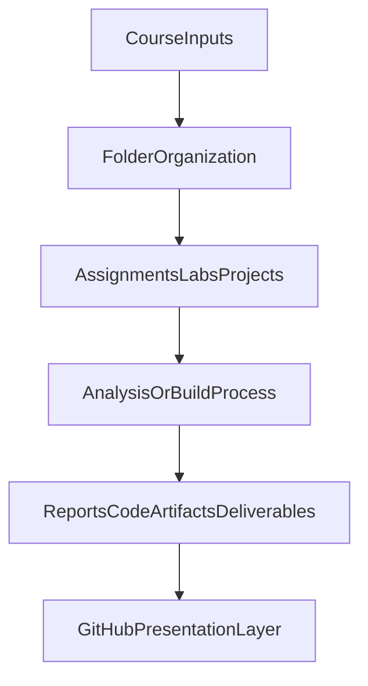

# IS445 Architecture

## Purpose
This diagram summarizes how work in `IS445` is organized from inputs to outputs.

## Workflow Diagram

## How to Read
- **CourseInputs**: prompts, datasets, and class instructions.
- **FolderOrganization**: semantic grouping for maintainability.
- **AssignmentsLabsProjects**: hands-on implementation work.
- **AnalysisOrBuildProcess**: computation, coding, and validation.
- **ReportsCodeArtifactsDeliverables**: final outputs stored in this class folder.
- **GitHubPresentationLayer**: README and docs that make the folder easy to present.
